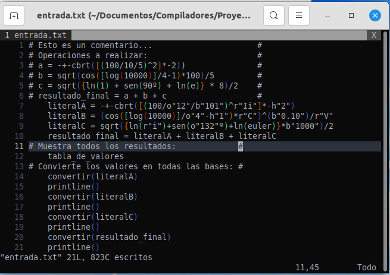
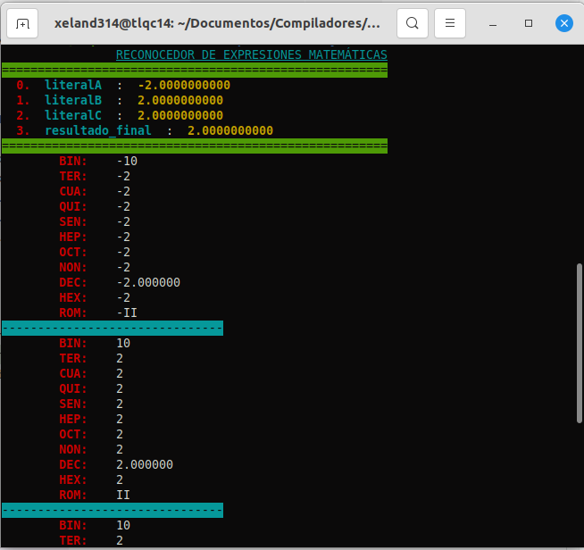

# Reconocedor de expresiones matemáticas

## Introducción

El analizador léxico es el encargado de reconocer y recuperarse de errores en las distintas etapas de compilación, además de ser la primera etapa en el proceso llevado a cabo dentro de un compilador. En el presente informe se explica con profundidad el desarrollo de un reconocedor de sistemas numéricos, destacando la importancia del uso de expresiones regulares para cumplir con los objetivos.

## Objetivos

Construir un reconocedor léxico óptimo que tenga las siguientes capacidades:

- Reconocer valor numérico de distintos sistemas de numeración mediante expresiones regulares.
- Realizar las respectivas conversiones de sistemas numéricos.
- Distinguir operadores aritméticos.
- Distinguir signos de apertura y cierre.
- Reconocer funciones matemáticas.

Implementar una gramática ambigua capaz de emular las operaciones que realiza una calculadora:

- Resolución y traducción de operaciones básicas.
- Utilizar operaciones con símbolos unarios: ```-1```, ```---1```, ```--+-1```, etc.
- Manejar funciones trigonométricas e hiperbólicas.
- Manejar operaciones con signos de agrupación: ```()[]{}```

Implementar un sistema para guardar los valores ingresados por consola para volver a utilizarlos, como si se tratará de un lenguaje de programación.

## Descripción del problema / requerimientos

El usuario podrá ingresar uno o más números, tales que pueden pertenecer a los diferentes sistemas numéricos.

Se requiere que el programa reconozca los distintos sistemas numéricos y responda con su correspondiente equivalencia distintas bases. Además, el programa debe distinguir operadores aritméticos y signos de apertura y cierre (paréntesis, corchetes, llaves). Por lo tanto, se plantea el uso de expresiones regulares óptimas para limitar el ingreso de datos, así facilitando el proceso de identificación. Incluso, utilizando dichas expresiones regulares como estructuras de control.

## Números que reconoce

| Sistema Numérico | Letra reconocida | Secuencias válidas | Ejemplos |
|------------:|:------:|:-----------:|:--------:|
|     Binario | (b\|B) | [0-1]       |   b"1111"  |
|    Ternario | (t\|T) | [0-2]       |    T"12"   |
| Cuaternario | (c\|C) | [0-3]       |    c"22"   |
|    Quinario | (q\|Q) | [0-4]       |   -q"11"   |
|     Senario | (x\|X) | [0-5]       |   x"100"   |
|      Heptal | (s\|S) | [0-6]       |    s"21"   |
|       Octal | (o\|O) | [0-7]       |    o"7"    |
|     Nonario | (n\|N) | [0-8]       |    N"81"   |
|     Decimal |        | [0-9]       |    100     |
| Hexadecimal | (h\|H) | [0-9a-fA-F] |    H"F"    |
|      Romano | (r\|R) |             | r"mmmCCXIV"|

El programa tiene la capacidad de reconocer números en todas los sistemas numéricos descritos en la tabla superior. **No olvide acotar los números entre comillas**.

Además, cabe añadir, es capaz de reconocer números en esas bases con decimales. Por ejemplo: ```b"111.11"``` que corresponde al número ```7.75```.
En el caso de los números binarios, no están en complemento a 2.

*Nota: Los números en bases distintas a la decimal deben estar acotados entre comillas.*

### Extensión de los números romanos

Los números romanos se representand con las siguientes letras:

|  Letra | Valor  |
|:------:|-------:|
| (i\|I) |    1   |
| (v\|V) |    5   |
| (x\|X) |   10   |
| (l\|L) |   50   |
| (c\|C) |   100  |
| (d\|D) |   500  |
| (m\|M) |  1 000 |

Pero esto solo nos permite representar hasta la cantidad 3 999. La siguiente extensión nos permite trabajar con el límite de 3 999 999 999, aunque por consola solo se pueda ingresar hasta el 399 999 999:
|  Letra |  Valor     |Impresión|
|:------:|-----------:|:-------:|
| (n\|N) |   5 000    |  ṽ  |
| (o\|O) |   10 000   |  Ẋ  |
| (p\|P) |   50 000   |  Ḻ  |
| (q\|Q) |  100 000   |  ĉ  |
| (r\|R) |  500 000   |  ↁ  |
| (s\|S) |  1 000 000 |  ṁ  |
| (t\|T) |  5 000 000 |  Ṽ  |
| (u\|U) | 10 000 000 |  Ẍ  |
| (w\|W) | 50 000 000 |  Ḹ  |
| (y\|Y) |100 000 000 |  ḉ  |
|        |500 000 000 |  ↇ  |
|      |1 000 000 000 |  Ṁ  |

Esto hace posible ingresar valores por consola, en lugar de usar las letras V, X, L, C, D, M con [guión alto](https://es.wikipedia.org/wiki/Numeraci%C3%B3n_romana).

**Nota:** solo es capaz de representar números romanos enteros. En caso de querer transformar un número con decimales, el programa solo representará la parte entera.

---

## Integración Zig & C (Nueva Arquitectura)

Anteriormente, el proyecto utilizaba archivos intermediarios (stubs) y un puente en C para conectar funciones de Go. Ahora, el proyecto utiliza **Zig** como orquestador principal, eliminando la necesidad de `bridge.c` y archivos `.a` externos.

### ¿Por qué Zig?

1. **Seguridad de Memoria:** La tabla de símbolos utiliza un `StringHashMap` de Zig, gestionando la memoria de los nombres de variables de forma segura con `allocator.dupe`.
2. **Compatibilidad ABI-C:** Zig exporta funciones que Bison puede llamar directamente sin capas intermedias:
```zig
// En Zig (tokens.zig)
export fn valorDelToken(nombre: [*c]const u8) f64 {
    const key = std.mem.span(nombre);
    return tabla.get(key) orelse 0.0;
}

```
3. **WASM**: Permite compilar a WASM fácilmente.

---

## Ejecución y Compilación

Gracias a que Zig actúa como compilador de C, ya no es necesario configurar complejos archivos `make` manuales. El proceso se centraliza en el sistema de construcción de Zig:

1. **Generar el Analizador Léxico:**
`lex reconocedor.l`
2. **Generar el Analizador Sintáctico:**
`yacc -d proyecto.y`
3. **Compilar con Zig:**
- `zig build` o
- `zig cc -o calculadora lex.yy.c y.tab.c tokens.zig -lm` o
- make
4. **Para compilar a WASM**:
- `make wasm`


### Requisitos

* **Flex / Bison** (Instalados en el sistema).
* **Zig 0.13.0** o superior.

## Ejemplos de Uso


```bash
# Entrada por consola
y = 10
x = y++ + 5
x
>> 15.0000000000
y
>> 11.0000000000
convert(255)
        BIN:    11111111
        TER:    100110
        CUA:    3333
        QUI:    2010
        SEN:    1103
        HEP:    513
        OCT:    377
        NON:    313
        DEC:    255.000000
        HEX:    FF
        ROM:    CCLV
exit

```

## Ejemplos de ejecución

Se prepara algunas operaciones a realizar.

Se ejecuta en la consola: ```./math_app < entrada.txt > salidad.txt```

Resultado:

<p align="center">
  
  
</p>
