# Reconocedor de expresiones aritméticas

## Introducción

El analizador léxico es el encargado de reconocer y recuperarse de errores en las distintas etapas de compilación, además de ser la primera etapa en el proceso llevado a cabo dentro de un compilador. En el presente informe se explica con profundidad el desarrollo de un reconocedor de sistemas numéricos, destacando la importancia del uso de expresiones regulares para especificar patrones que pertenecen a un conjunto de cadenas.

## Objetivo

Construir un reconocedor léxico óptimo que tenga las siguientes capacidades:

- Reconocer valor numérico de distintos sistemas de numeración mediante expresiones regulares.
- Realizar las respectivas conversiones de sistemas numéricos.
- Distinguir operadores aritméticos. Ejemplos: signo de suma '+', resta '-', multiplicación '*', etc.
- Distinguir signos de apertura y cierre.

## Descripción del problema / requerimientos

El usuario podrá ingresar uno o más números, tales que pueden pertenecer a los diferentes sistemas numéricos.

Se requiere que el programa reconozca los distintos sistemas numéricos y responda con su correspondiente equivalencia distintas bases. Además, el programa debe distinguir operadores aritméticos y signos de apertura y cierre (paréntesis, corchetes, llaves, mayor y menor). Por lo tanto, se plantea el uso de expresiones regulares óptimas para limitar el ingreso de datos, así facilitando el proceso de identificación. Incluso, utilizando dichas expresiones regulares como estructuras de control.

## Números que reconoce

| Sistema Numérico | Letra reconocida | Secuencias válidas | Ejemplos |
|-----------------:|:----------------:|:------------------:|:--------:|
|          Binario |      (b\|B)      |        [0-1]       |   b1111  |
|         Ternario |      (t\|T)      |        [0-2]       |    T12   |
|      Cuaternario |      (c\|C)      |        [0-3]       |    c22   |
|         Quinario |      (q\|Q)      |        [0-4]       |   -q11   |
|          Senario |      (x\|X)      |        [0-5]       |   x100   |
|           Heptal |      (s\|S)      |        [0-6]       |    s21   |
|            Octal |      (o\|O)      |        [0-7]       |    o7    |
|          Nonario |      (n\|N)      |        [0-8]       |    N81   |
|          Decimal |                  |        [0-9]       |    100   |
|      Hexadecimal |      (h\|H)      |     [0-9a-fA-F]    |    HF    |
|           Romano |                  |                    | MMMCCXIV |

El programa tiene la capacidad de reconocer números en todas los sistemas numéricos descritos en la tabla superior.
Además, cabe añadir, es capaz de reconocer números en esas bases con decimales. Por ejemplo: ```b111.11``` que corresponde al número ```7.75```.
Incluso si son positivos o negativos; aunque para esto solo añade el signo. Y en el caso de los números binarios, no están en complemento a 2.

### Extensión de los números romanos

Los números romanos se representand con las siguientes letras:

|  Letra | Valor  |
|:------:|:------:|
| (i\|I) |    1   |
| (v\|V) |    5   |
| (x\|X) |   10   |
| (l\|L) |   50   |
| (c\|C) |   100  |
| (d\|D) |   500  |
| (m\|M) |  1 000 |

Pero esto solo nos permite representar hasta la cantidad 3 999. La siguiente extensión nos permite trabajar con el límite de 33 999 999:
|  Letra |  Valor     |
|:------:|:----------:|
| (n\|N) |   5 000    |
| (o\|O) |   10 000   |
| (p\|P) |   50 000   |
| (q\|Q) |  100 000   |
| (r\|R) |  500 000   |
| (s\|S) |  1 000 000 |
| (t\|T) |  5 000 000 |
| (u\|U) | 10 000 000 |

Esto hace posible ingresar valores por consola, en lugar de usar las letras V, X, L, C, D, M con [guión alto](https://es.wikipedia.org/wiki/Numeraci%C3%B3n_romana).

## Ejecución del programa

En la terminal de Ubuntu, se puede ejecutar los siguientes comandos:

- ```lex reconocedor.l```: permite usar lex para generar el archivo ```lex.yy.c```.
- ```gcc -o reconocedor lex.yy.c -lfl -lm```: permite compilar el código ```lex.yy.c```.
- ```./reconocedor```: ejecuta el programa.

Es importante a destacar ```-o reconocedor```, con esto logramos cambiar el nombre final del ejecutable en lugar de que el resultado final sea un ```a.out```.
Además, ```-lm``` permite incluir la librería ```<math.h>```.

## Arquitectura del programa

```plantuml
@startuml RECONOCEDOR
left to right direction

class funciones <<(M, #FF7700) Modulo>> #DeepSkyBlue ##[bold]DarkBlue
{
    include <stdio.h>
    include <stdlib.h>
    include <stdbool.h>
    include <math.h>
    include <string.h>
    - define longitud 256
    + mostrarInfo()
    - esUnaLetra(): bool
    - reemplazarLetraPorNumero(char letra): Int
    - reemplazarNumeroPorLetra(int numero): Char
    # asignarSigno(char* expresion): Int
    - calcularParteEnteraNumerica(char parteEntera, int base): long long int
    - calcularParteDecimalNumerica(char parteDecimal, int base): long double
    # representarNumericamente(char* expresion, int signoDelNumero, int base): long double
    + invertirSecuencia()
    + representarSimbolicamente(long double numero, int base)
    + imprimirLetra(int indice)
    + cambiarARomano(double numero)
    + mostrarResultadoEnTodasLasBases(double numero)
    + reconocerOperador(char* operador)
}

package "Numeros" #DDDDDD 
{


class binario <<(M, #FF7700) Modulo>> #AliceBlue ##[bold]Blue
{
    # define baseBinaria 2
    -- struct NumeroBinario --
    long double representacionNumerica;
    char* representacionSimbolica;
    --
    char* prepararEntrada(): char[]
    binToDecDouble()
}
class ternario <<(M, #FF7700) Modulo>> #LightPink 
{
    # define baseTernaria 3
    -- struct NumeroTernario --
    long double representacionNumerica;
    char* representacionSimbolica;
    --
    char* prepararEntrada(): char[]
    terToDecDouble()
}
class cuaternario <<(M, #FF7700) Modulo>> #PaleGreen ##[bold]Green
{
    # define baseCuaternaria 4
    -- struct NumeroCuaternario --
    long double representacionNumerica;
    char* representacionSimbolica;
    --
    char* prepararEntrada(): char[]
    cuaToDecDouble()
}
class quinario <<(M, #FF7700) Modulo>> #AliceBlue ##[bold]Blue
{
    # define baseQuinaria 5
    -- struct NumeroQuinario --
    long double representacionNumerica;
    char* representacionSimbolica;
    --
    char* prepararEntrada(): char[]
    quinToDecDouble()
}
class senario <<(M, #FF7700) Modulo>> #LightPink
{
    # define baseSenaria 6
    -- struct NumeroSenario --
    long double representacionNumerica;
    char* representacionSimbolica;
    --
    char* prepararEntrada(): char[]
    senaToDecDouble()
}
class heptal <<(M, #FF7700) Modulo>> #PaleGreen ##[bold]Green
{
    # define baseHeptal 7
    -- struct NumeroHeptal --
    long double representacionNumerica;
    char* representacionSimbolica;
    --
    char* prepararEntrada(): char[]
    heptToDecDouble()
}
class octal <<(M, #FF7700) Modulo>> #AliceBlue ##[bold]Blue
{
    # define baseOctal 8
    -- struct NumeroOctal --
    long double representacionNumerica;
    char* representacionSimbolica;
    --
    char* prepararEntrada(): char[]
    octToDecDouble()
}
class nonario <<(M, #FF7700) Modulo>> #LightPink
{
    # define baseNonaria 9
    -- struct NumeroNonario --
    long double representacionNumerica;
    char* representacionSimbolica;
    --
    char* prepararEntrada(): char[]
    nonToDecDouble()
}
class decimal <<(M, #FF7700) Modulo>> #PaleGreen ##[bold]Green
{
    # define baseDecimal 10
    -- struct NumeroDecimal --
    long double representacionNumerica;
    char* representacionSimbolica;
    --
    char* prepararEntrada(): char[]
    decToDecDouble()
}
class hexadecimal <<(M, #FF7700) Modulo>> #AliceBlue ##[bold]Blue
{
    # defina baseHexadecimal 16
    -- struct NumeroHexadecimal --
    long double representacionNumerica;
    char* representacionSimbolica;
    --
    char* prepararEntrada(): char[]
    hexToDecDouble()
}
class romano <<(M, #FF7700) Modulo>> #LightPink
{
    -- struct NumeroRomano --
    long double representacionNumerica;
    char* representacionSimbolica;
    --
    char* prepararEntrada(): char[]
    romToDecDouble()
}
}
class Reconocedor <<(P, Orchid) Programa>>
{
    -- %{ --
    include <stdio.h>
    include <stdlib.h>
    include <string.h>
    include "binario.h"
    include "ternaria.h"
    include "cuaternaria.h"
    include "quinario.h"
    include "senario.h"
    include "heptal.h"
    include "octal.h"
    include "nonario.h"
    include "decimal.h"
    include "hexadecimal.h"
    include "romanos.h"
    -- %} --
    - ExpresionesRegulares
    -- %% --
    + KEYWORD1         
    + OPERADOR          
    + ABRIR             
    + CERRAR            
    + BINARIO          
    + TERNARIO          
    + CUATERNARIO       
    + QUINARIO          
    + SENARIO         
    + HEPTAL            
    + OCTAL           
    + NONARIO 
    + DECIMAL                   
    + HEXADECIMAL      
    + ROMANO         
    + ERROR            
    + EspaciosTabuladores         
    + .                   
    -- %% --
    int main()
}

Reconocedor::OPERADOR       -up-> funciones::reconocerOperador #blue
Reconocedor::KEYWORD1       -up-> funciones::mostrarInfo #blue

Reconocedor::BINARIO        --> binario::binToDecDouble #blue
Reconocedor::TERNARIO       --> ternario::terToDecDouble
Reconocedor::CUATERNARIO    --> cuaternario::cuaToDecDouble #green
Reconocedor::QUINARIO       --> quinario::quinToDecDouble #blue
Reconocedor::SENARIO        --> senario::senaToDecDouble 
Reconocedor::HEPTAL         ----> heptal::heptToDecDouble #green
Reconocedor::OCTAL          --> octal::octToDecDouble #blue
Reconocedor::NONARIO        --> nonario::nonToDecDouble
Reconocedor::DECIMAL        --> decimal::decToDecDouble #green
Reconocedor::HEXADECIMAL    --> hexadecimal::hexToDecDouble #blue
Reconocedor::ROMANO         --> romano::romToDecDouble

@enduml
```


